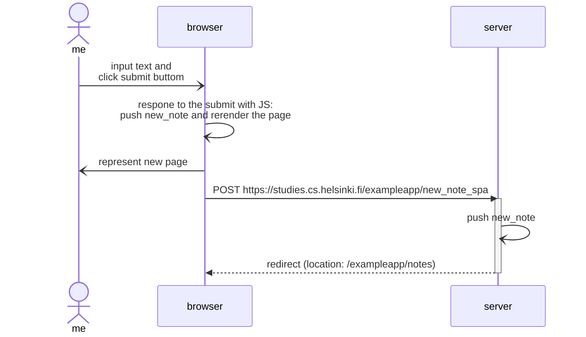

```mermaid
sequenceDiagram
    actor me
    participant browser
    participant server
    

    me -) browser:input text and <br> click submit buttom
    
    browser -) browser: respone to the submit with JS:<br> push new_note and rerender the page

    browser -) me: represent new page
    browser->>server: POST https://studies.cs.helsinki.fi/exampleapp/new_note_spa
    activate server
    server -) server: push new_note
    server-->>browser: redirect (location: /exampleapp/notes)
    deactivate server
```